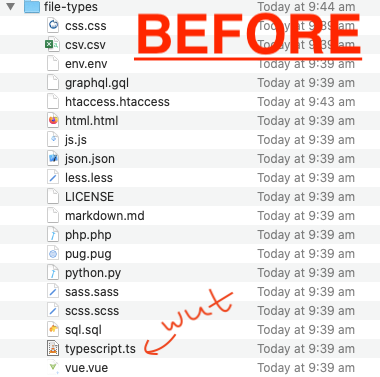
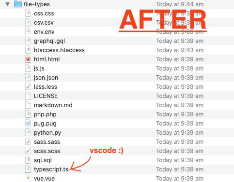

# default-file-types

Batch fix default programs to save time

## Wot?

You've installed a new app and suddenly it takes over file associations on your system.

Over time you end up with:

1. Typescript files associated with `VLC.app` !???? 🤦‍♀️
2. SQL files associated with `Tableplus.app` 🤦‍♂️
3. JSON files associated with `Xcode.app` 🤦‍♂️
4. CSS files assocated with `MAMP.app` 🤦‍♀️
5. CSV files associated with `Microsoft Excel.app` 🤦‍♂️
6. Python and PHP files associated with `Max for Live.app` 🤦‍♀️ 🤦‍♂️

## So?

This WILL be something you just go "eh, too much work" and ignore. And over the course of your life, it will eat up 10,000 productive hours of your time.

The solution is to do it in one batch manually - or even better - write a program that does it for you.

All I've done here is gather up some of my commonly used web development file-types into one folder, so I don't have to jump around all my files.

I haven't written a program (yet), but I'm thinking it will probably need to be an AppleScript thing?

Egh.

## Result

⛔ **Before:** Files all whacked out (as mentioned above)

✅ **After:** Files all associated with VSCodium, and all is right in the world again.
